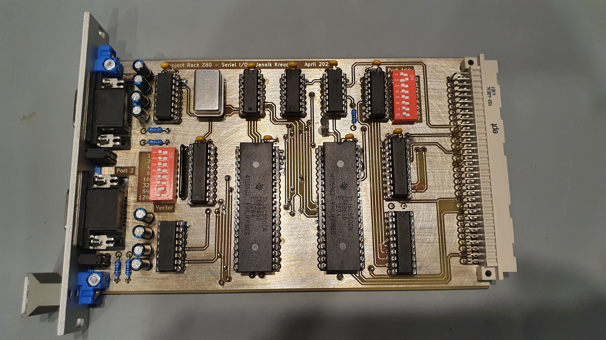

# Serial I/O

Copyright 2021 Jannik Kreucher

## Table of Contents
 - [How it works](#how-it-works)
 - [Schematic](#schematic)

## How it works
TODO

## Schematic
The [schematic](documentation/RackZ80_RS232.pdf) exported as pdf. So it is ready to print.
